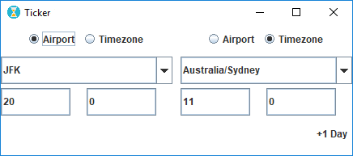

# Global-Airport-Time-Converter

This is a desktop app that can be used by flight handling personnels to convert time between airport codes and/or timezones

### Background
It is a tedious task for those handling global flight operations to calculate time between airports. for example, if a flight departs New york and arrives Sydney, to calculate the local time of new york when the flight arrive, the personnel should find corresponding time zone where new york airport located and then calculate its GMT offset and calculate the local time 

This tool is intended to remove this difficulties and convert the times in few clicks.

### Programming language and tools
This app is purely written in Java with notepad and compiled with jdk manually. no special tools used
